# strapi_blog_website

I'm building Personal Blog website, The purpose of this project is to get used to 

TypeScript, Tailwind, Clerk, and Strapi.

From below will be my Thought flow for this web page.

Start.

Lets create a Nav bar. 

I'm thinking of creating this first so :

I can get used to Clerk authentication system, and tailwind.

# TYPESCRIPT
============

I'm getting used to typescript.

when you 

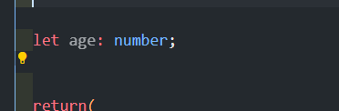

You can assign data type for a variable.

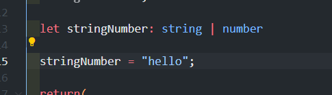

same applies to array.

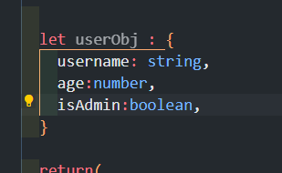

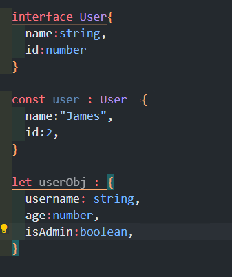

you can also create interface then linking it with an object

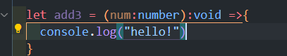

if you want a function to do something but return nothing, you can also just put :void.

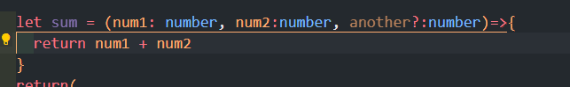

If you want to add a parameter that doesn't have to be listed you can also add another? and give datatype to it.

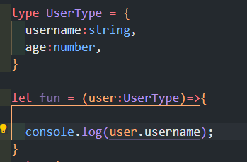

you can also create your own type.

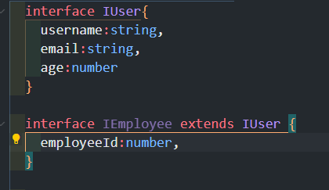

You can also use it like class 

# Tailwind
============

### Creating a utility class
=============================

First I wanted to create an uitilty class for container.

In order to do that I have used 

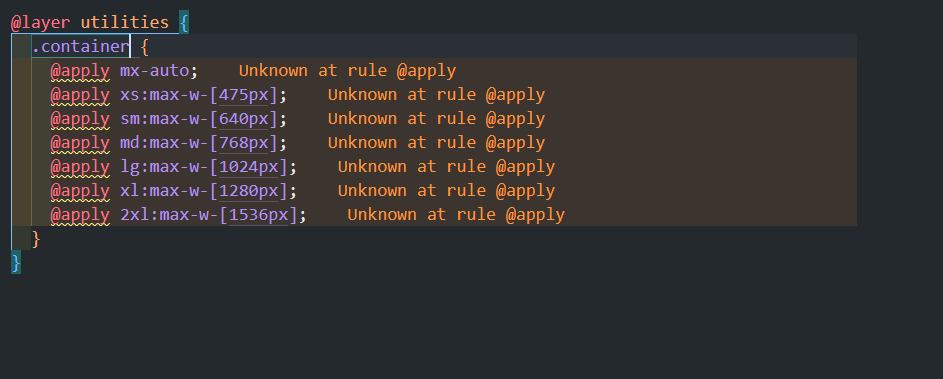

@layer and @apply in globals css file.

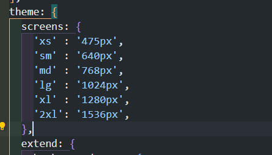

then I also set my custom theme.

had a change of plan, instead of giving container class in nav bar, I gave it in 

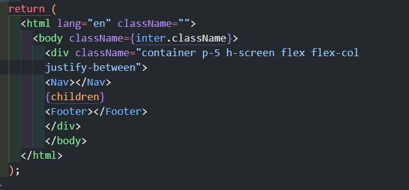

### background

I'm going to use the div that contains all the content and give a back ground color 

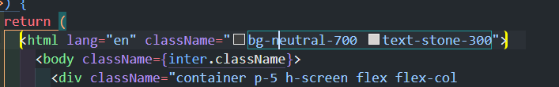

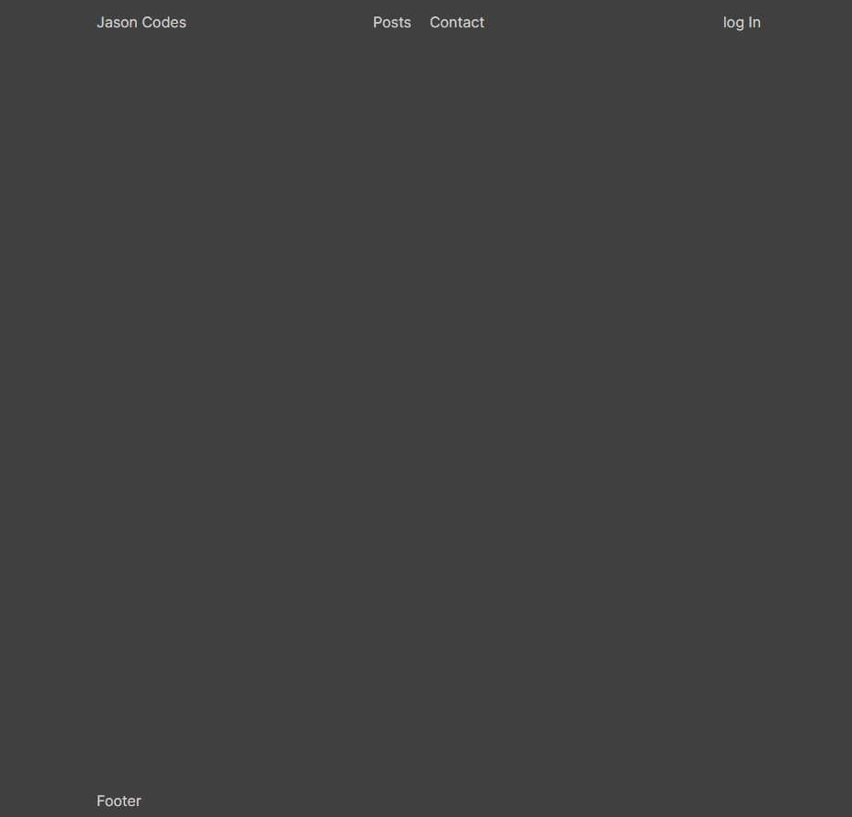

# NextJS 
=========

### Routing in next

all you need to do for next js is to create a folder and name it.

it is better practice to put use first class citizen for some reason (will find out more.)

for dynamic routing 

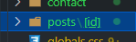

You just have to put it like that.

### choosing images

importing it from public folder

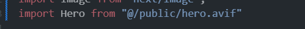

then 

# Strapi
========

# Clerk
========

